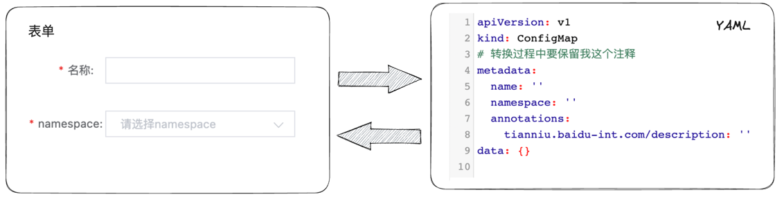

# Form2Yaml

实现Form表单和Yaml数据的转换。


Form2Yaml支持以下特性
- 在转换中保留Yaml注释
- 像校验表单（validate）那样校验Yaml数据
- 支持Form的key与Yaml的key映射


# 安装
```shell
npm install form2yaml
```

# 使用示例

## 构造Form2Yaml对象，从Yaml获取JSON

首先通过new 构造Form2Yaml对象实例，构造函数第一个参数为yaml默认内容，第二个参数为options
```javascript
import Form2Yaml from 'form2yaml';
let yaml = `
 meta:
   name: test  #注释
   namespace: default
 `;
const form2Yaml = new Form2Yaml(yaml);

//根据yaml获取json
console.log(form2Yaml.getJson());
//  {
//    "meta": {
//      "name": "test",
//      "namespace": "default"
//    }
//  }
```
通过调用form2Yaml.getJson()方法，将yaml数据转为json数据。

有时yaml的key和表单的key并不一致，比如上述示例中的 meta.name，在表单中可能key为name，，可以通过指定keyMap来设置formKey和yamlKey的映射关系。

```javascript
import Form2Yaml from 'form2yaml';
let yaml = `
 meta:
   name: test  #注释
   namespace: default
 `
const form2Yaml = new Form2Yaml(yaml, {
    keyMap:{
        name: 'meta.name'
    }
});

//根据yaml获取json
console.log(form2Yaml.getJson())
//  {
//    "name": "test",
//  }
```

设置keyMap后，调用form2Yaml.getJson()默认只返回keyMap指定的字段，如果要返回全部数据，需要这么调用 form2Yaml.getJson('all')

```javascript
let yaml = `
 meta:
   name: test  #注释
   namespace: default
 `
const form2Yaml = new Form2Yaml(yaml, {
    keyMap:{
        name: 'meta.name'
    }
});
console.log(form2Yaml.getJson('all'))
//  {
//    "name": "test",
//    "meta": {
//      "namespace": "default"
//    }
//  }
```
原本yaml中的meta.name属性现在映射到了name属性，其他没有设置keyMap的属性，保持原状。

## 根据表单数据更新YAML

通过form2Yaml.setJson(jsonData)可以修改yaml数据，通过form2Yaml.getYaml()可以获取修改后的yaml数据。

```javascript
  const yaml = `
 meta:
   name: test  #注释
   namespace: default
 `;
const form2Yaml = new Form2Yaml(yaml);

form2Yaml.setJson({
    meta: {
        name: 'newName'
    }
})
console.log(form2Yaml.getYaml())
// meta:
//   name: newName  #注释
//   namespace: default
```
在上述示例中，只修改了meta.name的值，可以看到，新的yaml中保留了注释，且meta.namespace未发生变化。

如果你期望没有传递 meta.namespace就认为应该修改为空值，则需要设置option.ignoreMissing=false。

```javascript
const yaml = `
 meta:
   name: test  #注释
   namespace: default
 `;

// 设置mergeJsonOfYaml为false
const form2Yaml = new Form2Yaml(yaml, {
    mergeJsonOfYaml: false
});

form2Yaml.setJson({
    meta: {
        name: 'newName'
    }
})
console.log(form2Yaml.getYaml())
//打印的数据中没有了meta.namespace
// meta:
//   name: newName  #注释
```

在上述示例中，没有传递meta.namespace，或者认为meta.namespace为undefined，修改后的yaml中将会删除meta.namespace字段，如果你想让某个字段在空值时还保留在yaml中，可以设置每个字段的空值模式emptyMode。

```javascript
const yaml = `
 meta:
   name: test  #注释
   namespace: default
 `;
const form2Yaml = new Form2Yaml(yaml, {
    emptyMode: {
        'meta.namespace': 'retain'
    }
});

form2Yaml.setJson({
    meta: {
        name: 'newName',
        namespace: undefined
    }
})
console.log(form2Yaml.getYaml())
// meta:
//   name: newName  #注释
//   namespace:
```
在将meta.namespace空值模式设为'retain'后，即使meta.namespace=undefined，依然在yaml中保留namespace字段。

setJson依然支持keyMap配置：

```javascript
const yaml = `
 meta:
   name: test  #注释
   namespace: default
 `;
const form2Yaml = new Form2Yaml(yaml, {
    keyMap: {
        name: 'meta.name'
    }
});

form2Yaml.setJson({
    name: 'newName',
})
console.log(form2Yaml.getYaml())
// meta:
//   name: newName  #注释
//   namespace: default
```

## 更新yaml数据

调用setYaml(newYaml)修改yaml数据。
```javascript
const yaml = `
 meta:
   name: test  #注释
   namespace: default
   age: NaN
 `;
const form2Yaml = new Form2Yaml(yaml);

const newYaml = `
 meta:
   name: newName  #注释
   namespace: default
 `;

form2Yaml.setYaml(newYaml);
```

## yaml校验

```javascript
const yaml = `
 meta:
   name: test  #注释
   namespace: default
   age: NaN
 `;
const form2Yaml = new Form2Yaml(yaml, {
    rules: {
        'meta.age': [{pattern: /^\d+$/, message: '年龄必须为数字'}]
    }
});

form2Yaml.validate().then(_ => {
    console.log('校验通过')
}).catch(err => {
    console.log('校验失败')
    console.log(err)
})
```

